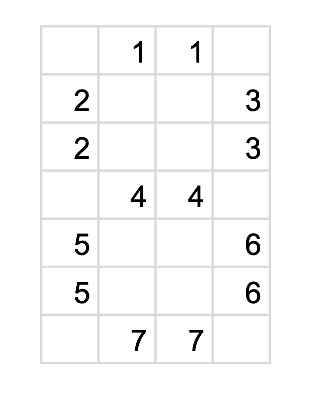

```{r warning=FALSE}
library(stringr)
library(tidyverse)
library(data.table)

dt <- data.table::fread("input.txt", header = FALSE)
```


```{r}
# part 1
dt2 <- data.table("output" = dt$V2)
dt2 <- as.character(unlist(strsplit(dt2$output, " ")))
length(dt2[nchar(dt2) %in% c(2, 3, 4, 7)])
```

\pagebreak

> This is how I laid out my positions

```{r echo=FALSE, out.width=100}

```

```{r}
# part 2
df <- data.table::fread("input.txt", header = FALSE)
dt1 <- data.table("input" = df$V1)
dt1 <- data.table(str_split(dt1$input, " ", simplify = TRUE))
dt2 <- data.table("output" = df$V2)
dt2 <- data.table(str_split(dt2$output, " ", simplify = TRUE))
df <- cbind(dt1, dt2)

sortV <- function(x) {
  sapply(lapply(strsplit(x, NULL), sort), paste, collapse="")
}

getNumber <- function(x1) {
  display <- c("p1" = "",
               "p2" = "",
               "p3" = "",
               "p4" = "",
               "p5" = "",
               "p6" = "",
               "p7" = "")
  x <- as.character(x1[1:10])
  one <- ""
  four <- ""
  seven <- ""
  eight <- ""
  
  for (i in 1:10) {
    if (nchar(x[i]) == 2) one <- x[i]
    if (nchar(x[i]) == 3) seven <- x[i]
    if (nchar(x[i]) == 4) four <- x[i]
    if (nchar(x[i]) == 7) eight <- x[i]
  }
  
  # determine p1
  display["p1"] <- str_split(seven, "", simplify = TRUE)[
    !(str_split(seven, "", simplify = TRUE) %in% 
        str_split(one, "", simplify = TRUE))]
  
  # determine p57
  p57 <- paste0(seven, four, collapse = "")
  p57 <- str_split(p57, "", simplify = TRUE)
  p27 <- as.character(unlist(str_split(x[nchar(x) == 5], "")))
  p27 <- p27[!(p27 %in% p57)]
  display["p5"] <- names(sort(table(p27)))[1]
  display["p7"] <- names(sort(table(p27)))[2]
  
  # determine p36
  p24 <- str_split(eight, "", simplify = TRUE)[
    !(str_split(eight, "", simplify = TRUE) %in% 
        str_split(one, "", simplify = TRUE))]
  p24 <- p24[!(p24 %in% display)]
  p <- as.character(unlist(str_split(x[nchar(x) == 6], "")))
  p <- p[!(p %in% p24)]
  p <- sort(table(p))
  p36 <- p[(names(p) %in% str_split(one, "", simplify = TRUE))]
  display["p3"] <- names(p36)[1]
  display["p6"] <- names(p36)[2]
  
  # determine p24
  p24 <- unlist(str_split(x[nchar(x) == 5], ""))
  p24 <- sort(table(p24[!(p24 %in% display)]))
  display["p2"] <- names(p24)[1]
  display["p4"] <- names(p24)[2]
  display
  
  zero <- paste0(sort(display[c(1:3,5:7)]), collapse = "")
  one <- paste0(sort(display[c(3,6)]), collapse = "")
  two <- paste0(sort(display[c(1,3,4:5,7)]), collapse = "")
  three <- paste0(sort(display[c(1,3:4,6:7)]), collapse = "")
  four <- paste0(sort(display[c(2:4,6)]), collapse = "")
  five <- paste0(sort(display[c(1:2,4,6:7)]), collapse = "")
  six <- paste0(sort(display[c(1:2,4:7)]), collapse = "")
  seven <- paste0(sort(display[c(1,3,6)]), collapse = "")
  eight <- paste0(sort(display[c(1:7)]), collapse = "")
  nine <- paste0(sort(display[c(1:4,6:7)]), collapse = "")
  
  x <- as.character(x1[11:14])
  x <- sapply(x, sortV)
  
  returnNumber <- function(x) {
    return(case_when(
      x == zero ~ 0,
      x == one ~ 1,
      x == two ~ 2,
      x == three ~ 3,
      x == four ~ 4,
      x == five ~ 5,
      x == six ~ 6,
      x == seven ~ 7,
      x == eight ~ 8,
      x == nine ~ 9
    ))
  }
  
  x <- paste0(sapply(x, returnNumber), collapse = "")
  return(as.numeric(x))
}

sum(apply(df, 1, getNumber))
```

